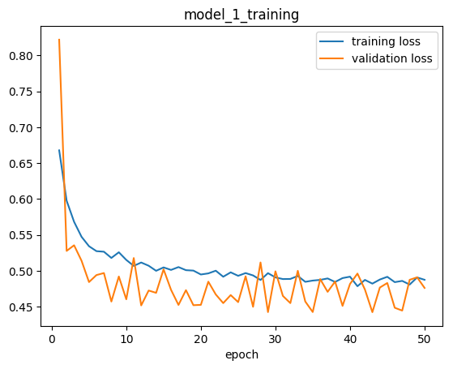
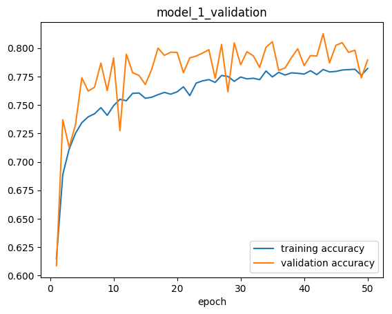
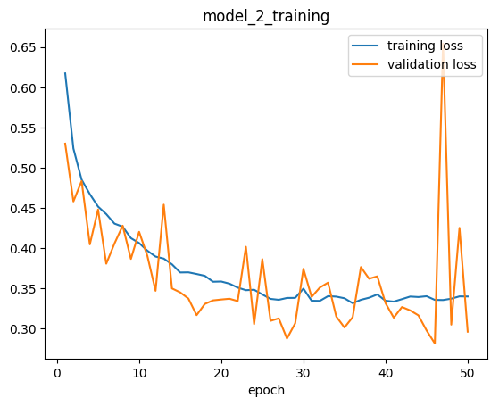
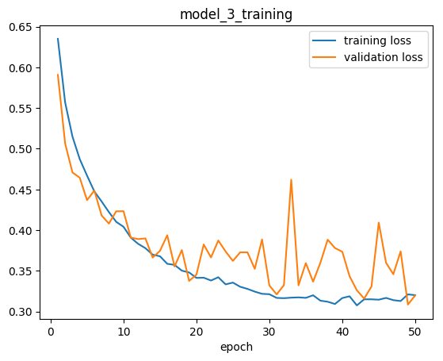
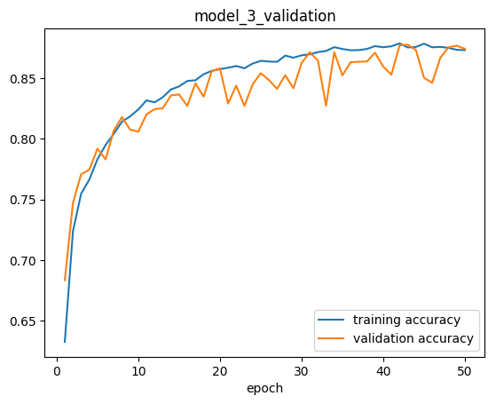
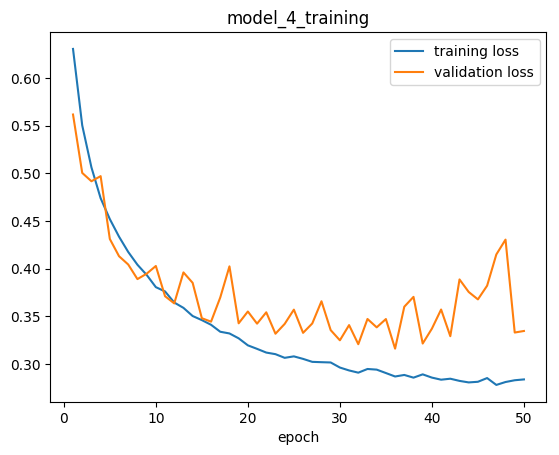
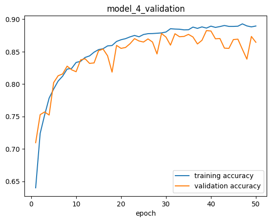
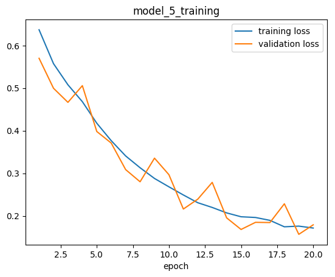
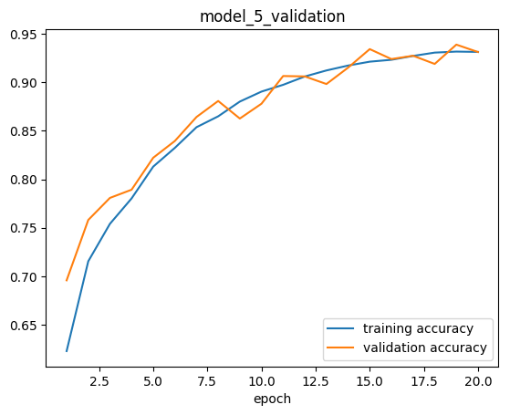

<h3 align="center">
  
</h3>

# Image Classifier

Python Jupyter Notebook with **Convolutional Neural Network** image classifier implemented in **Keras** 🖼️. It's **[Google Colab](https://colab.research.google.com/)** ready.

Check out corresponding Medium article:

[Image Classifier - Cats🐱 vs Dogs🐶 with Convolutional Neural Networks (CNNs) and Google Colab’s Free GPU](https://towardsdatascience.com/image-classifier-cats-vs-dogs-with-convolutional-neural-networks-cnns-and-google-colabs-4e9af21ae7a8)

## Usage

Structure your data as follows:

	data/
		training/
			class_a/
				class_a01.jpg
				class_a02.jpg
				...
			class_b/
				class_b01.jpg
				class_b02.jpg
				...
		validation/
			class_a/
				class_a01.jpg
				class_a02.jpg
				...
			class_b/
				class_b01.jpg
				class_b02.jpg
				...

For binary classifications you are good to go!

For non-binary classifications:

* add other classes to training and validation directories
* change class_mode from "binary" to "categorical"
* change loss function from "binary\_crossentropy" to "categorical\_crossentropy"

## Performance

**Dataset:** [Dogs vs Cats](https://www.kaggle.com/c/dogs-vs-cats)

**Description:** Binary classification. Two classes two distinguish - **dogs** and **cats**.

**Training:** 10 000 images per class

**Validation:** 2 500 images per class

### model_1
	_________________________________________________________________
	Layer (type)                 Output Shape              Param #   
	=================================================================
	conv2d_5 (Conv2D)            (None, 198, 198, 32)      896       
	_________________________________________________________________
	activation_9 (Activation)    (None, 198, 198, 32)      0         
	_________________________________________________________________
	max_pooling2d_5 (MaxPooling2 (None, 99, 99, 32)        0         
	_________________________________________________________________
	conv2d_6 (Conv2D)            (None, 97, 97, 32)        9248      
	_________________________________________________________________
	activation_10 (Activation)   (None, 97, 97, 32)        0         
	_________________________________________________________________
	max_pooling2d_6 (MaxPooling2 (None, 48, 48, 32)        0         
	_________________________________________________________________
	flatten_3 (Flatten)          (None, 73728)             0         
	_________________________________________________________________
	dense_5 (Dense)              (None, 16)                1179664   
	_________________________________________________________________
	activation_11 (Activation)   (None, 16)                0         
	_________________________________________________________________
	dropout_3 (Dropout)          (None, 16)                0         
	_________________________________________________________________
	dense_6 (Dense)              (None, 1)                 17        
	_________________________________________________________________
	activation_12 (Activation)   (None, 1)                 0         
	=================================================================
	Total params: 1,189,825
	Trainable params: 1,189,825
	Non-trainable params: 0
	_________________________________________________________________

 

### model_2
	_________________________________________________________________
	Layer (type)                 Output Shape              Param #   
	=================================================================
	conv2d_4 (Conv2D)            (None, 198, 198, 32)      896       
	_________________________________________________________________
	activation_6 (Activation)    (None, 198, 198, 32)      0         
	_________________________________________________________________
	max_pooling2d_4 (MaxPooling2 (None, 99, 99, 32)        0         
	_________________________________________________________________
	conv2d_5 (Conv2D)            (None, 97, 97, 32)        9248      
	_________________________________________________________________
	activation_7 (Activation)    (None, 97, 97, 32)        0         
	_________________________________________________________________
	max_pooling2d_5 (MaxPooling2 (None, 48, 48, 32)        0         
	_________________________________________________________________
	conv2d_6 (Conv2D)            (None, 46, 46, 64)        18496     
	_________________________________________________________________
	activation_8 (Activation)    (None, 46, 46, 64)        0         
	_________________________________________________________________
	max_pooling2d_6 (MaxPooling2 (None, 23, 23, 64)        0         
	_________________________________________________________________
	flatten_2 (Flatten)          (None, 33856)             0         
	_________________________________________________________________
	dense_3 (Dense)              (None, 64)                2166848   
	_________________________________________________________________
	activation_9 (Activation)    (None, 64)                0         
	_________________________________________________________________
	dropout_2 (Dropout)          (None, 64)                0         
	_________________________________________________________________
	dense_4 (Dense)              (None, 1)                 65        
	_________________________________________________________________
	activation_10 (Activation)   (None, 1)                 0         
	=================================================================
	Total params: 2,195,553
	Trainable params: 2,195,553
	Non-trainable params: 0
	_________________________________________________________________

 

### model_3
	_________________________________________________________________
	Layer (type)                 Output Shape              Param #   
	=================================================================
	conv2d_4 (Conv2D)            (None, 198, 198, 32)      896       
	_________________________________________________________________
	activation_6 (Activation)    (None, 198, 198, 32)      0         
	_________________________________________________________________
	max_pooling2d_4 (MaxPooling2 (None, 99, 99, 32)        0         
	_________________________________________________________________
	conv2d_5 (Conv2D)            (None, 97, 97, 64)        18496     
	_________________________________________________________________
	activation_7 (Activation)    (None, 97, 97, 64)        0         
	_________________________________________________________________
	max_pooling2d_5 (MaxPooling2 (None, 48, 48, 64)        0         
	_________________________________________________________________
	conv2d_6 (Conv2D)            (None, 46, 46, 128)       73856     
	_________________________________________________________________
	activation_8 (Activation)    (None, 46, 46, 128)       0         
	_________________________________________________________________
	max_pooling2d_6 (MaxPooling2 (None, 23, 23, 128)       0         
	_________________________________________________________________
	flatten_2 (Flatten)          (None, 67712)             0         
	_________________________________________________________________
	dense_3 (Dense)              (None, 64)                4333632   
	_________________________________________________________________
	activation_9 (Activation)    (None, 64)                0         
	_________________________________________________________________
	dropout_2 (Dropout)          (None, 64)                0         
	_________________________________________________________________
	dense_4 (Dense)              (None, 1)                 65        
	_________________________________________________________________
	activation_10 (Activation)   (None, 1)                 0         
	=================================================================
	Total params: 4,426,945
	Trainable params: 4,426,945
	Non-trainable params: 0
	_________________________________________________________________

 

### model_4
	_________________________________________________________________
	Layer (type)                 Output Shape              Param #   
	=================================================================
	conv2d_7 (Conv2D)            (None, 198, 198, 32)      896       
	_________________________________________________________________
	activation_11 (Activation)   (None, 198, 198, 32)      0         
	_________________________________________________________________
	max_pooling2d_7 (MaxPooling2 (None, 99, 99, 32)        0         
	_________________________________________________________________
	conv2d_8 (Conv2D)            (None, 97, 97, 64)        18496     
	_________________________________________________________________
	activation_12 (Activation)   (None, 97, 97, 64)        0         
	_________________________________________________________________
	max_pooling2d_8 (MaxPooling2 (None, 48, 48, 64)        0         
	_________________________________________________________________
	conv2d_9 (Conv2D)            (None, 46, 46, 128)       73856     
	_________________________________________________________________
	activation_13 (Activation)   (None, 46, 46, 128)       0         
	_________________________________________________________________
	max_pooling2d_9 (MaxPooling2 (None, 23, 23, 128)       0         
	_________________________________________________________________
	flatten_3 (Flatten)          (None, 67712)             0         
	_________________________________________________________________
	dense_5 (Dense)              (None, 128)               8667264   
	_________________________________________________________________
	activation_14 (Activation)   (None, 128)               0         
	_________________________________________________________________
	dropout_3 (Dropout)          (None, 128)               0         
	_________________________________________________________________
	dense_6 (Dense)              (None, 1)                 129       
	_________________________________________________________________
	activation_15 (Activation)   (None, 1)                 0         
	=================================================================
	Total params: 8,760,641
	Trainable params: 8,760,641
	Non-trainable params: 0
	_________________________________________________________________

 

### model_5

	_________________________________________________________________
	Layer (type)                 Output Shape              Param #   
	=================================================================
	conv2d_1 (Conv2D)            (None, 200, 200, 32)      896       
	_________________________________________________________________
	conv2d_2 (Conv2D)            (None, 200, 200, 32)      9248      
	_________________________________________________________________
	max_pooling2d_1 (MaxPooling2 (None, 100, 100, 32)      0         
	_________________________________________________________________
	conv2d_3 (Conv2D)            (None, 100, 100, 64)      18496     
	_________________________________________________________________
	conv2d_4 (Conv2D)            (None, 100, 100, 64)      36928     
	_________________________________________________________________
	max_pooling2d_2 (MaxPooling2 (None, 50, 50, 64)        0         
	_________________________________________________________________
	conv2d_5 (Conv2D)            (None, 50, 50, 128)       73856     
	_________________________________________________________________
	conv2d_6 (Conv2D)            (None, 50, 50, 128)       147584    
	_________________________________________________________________
	max_pooling2d_3 (MaxPooling2 (None, 25, 25, 128)       0         
	_________________________________________________________________
	conv2d_7 (Conv2D)            (None, 25, 25, 256)       295168    
	_________________________________________________________________
	conv2d_8 (Conv2D)            (None, 25, 25, 256)       590080    
	_________________________________________________________________
	max_pooling2d_4 (MaxPooling2 (None, 12, 12, 256)       0         
	_________________________________________________________________
	flatten_1 (Flatten)          (None, 36864)             0         
	_________________________________________________________________
	dense_1 (Dense)              (None, 256)               9437440   
	_________________________________________________________________
	dropout_1 (Dropout)          (None, 256)               0         
	_________________________________________________________________
	dense_2 (Dense)              (None, 256)               65792     
	_________________________________________________________________
	dropout_2 (Dropout)          (None, 256)               0         
	_________________________________________________________________
	dense_3 (Dense)              (None, 1)                 257       
	_________________________________________________________________
	activation_1 (Activation)    (None, 1)                 0         
	=================================================================
	Total params: 10,675,745
	Trainable params: 10,675,745
	Non-trainable params: 0
	_________________________________________________________________

 

## Author

**Greg (Grzegorz) Surma**

[**PORTFOLIO**](https://gsurma.github.io)

[**GITHUB**](https://github.com/gsurma)

[**BLOG**](https://medium.com/@gsurma)

